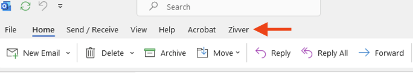
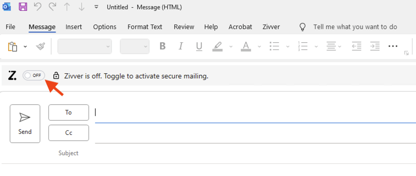
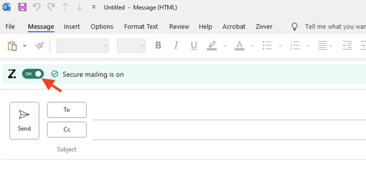
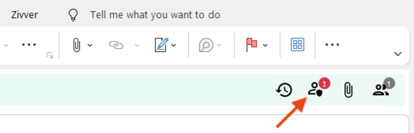
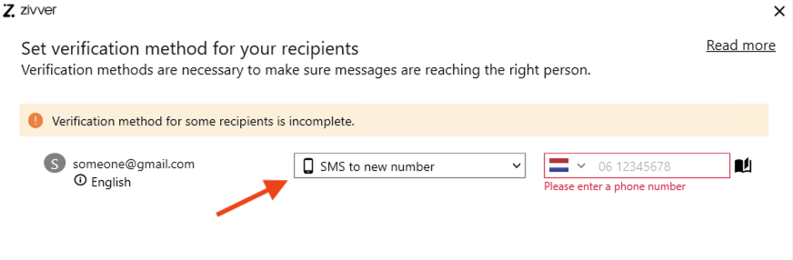
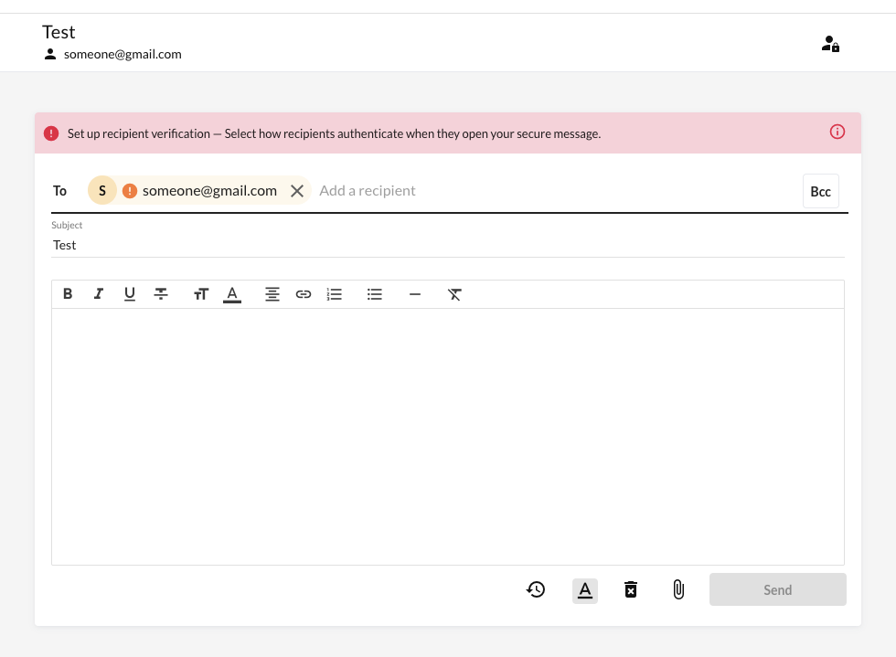

## Instructions for Windows users (or when using the Remote Windows 10 Desktop)

Before starting, check if your Outlook desktop app has the ZIVVER plugin installed. There should be a tab for ZIVVER at the top of the application window if the plugin is already installed (this will be the case when using the Remote Desktop).   If you don't see a tab for ZIVVER, go to [download.vu.nl](https://download.vu.nl){target="_blank"} to install the plugin. If you are unable to install the plugin, simply follow the [directions for MacOS/Linux users](#maclinux) to use ZIVVER in the browser app.

1. Open Outlook and start a new e-mail.
2. On the top left of the new e-mail window (above the To: field), find and turn on the ZIVVER toggle.   There should now be a notification bar that says "Secure mailing is on".   
3. Enter the e-mail of the recipient. Because the recipient will likely not have a VU e-mail address, you will see an exclamation mark show up on the top right side of the notification bar. Click on this icon.  

4. A pop-up box will ask you to choose an identity verification method.   The preferred option is to send an SMS to the recipient on their mobile phone. 
   a. If the recipient does not have a mobile phone that can receive an SMS, select the Access Code option and enter a password. Do not share this password with the participant via e-mail; call them to provide them with the access code.
   b. If you need to change the verification method or update the information used in the verification method, you can simply click on the icon of the person with the little shield next to them (to the right of the clock).
5. Complete the e-mail text with all of the necessary information and attachments.
   a. One option is to provide the information letter and consent form in the attachments. Alternatively, you can provide the information letter in the attachments and the text of the consent form in the body of the e-mail.
   b. Make sure the content of your consent form and information letter confirm to the necessary ethical and legal requirements. See this [checklist](ICFChecklist.html){target="_blank"} for more information. 
6. Once the e-mail is sent, the recipient will receive an e-mail from you with a link that takes them to the secure ZIVVER environment. This link will ask them to authenticate using the method selected in step 4. 
7. Once authenticated, the recipient can read your e-mail and attachments, as well as reply within the online ZIVVER environment. 
   a. If both the information letter and consent form are found in the attachments, the recipient can download and print these, indicate and sign their consent, and reupload the completed consent form to send back to you.
   b. If the consent text is in the body of the e-mail, the recipient can copy this text into their reply, indicate that "yes, they do give consent", as well as their name and the date. (A [signature is not legally required by the GDPR](ICFChecklist.html#digital){target="_blank"})
8. Save the response you receive as a PDF in an [appropriate storage location](../Security/Storage.html){target="_blank"}.

## Instructions for MacOS/Linux users {#maclinux}

1. Open the [ZIVVER online app](https://app.zivver.com/){target="_blank"} and login with your VU credentials
    a. Simply enter your VU e-mail and the page will automatically redirect to the VU login page; make sure to replace your e-mail with your VU ID in the username field.
2. Start a new e-mail by clicking on the pencil symbol at the bottom of the screen:
3. Fill in the recipient's e-mail address and click on the warning that pops up.   
4. Follow [steps 4 through 8 above](#sameInstr).
