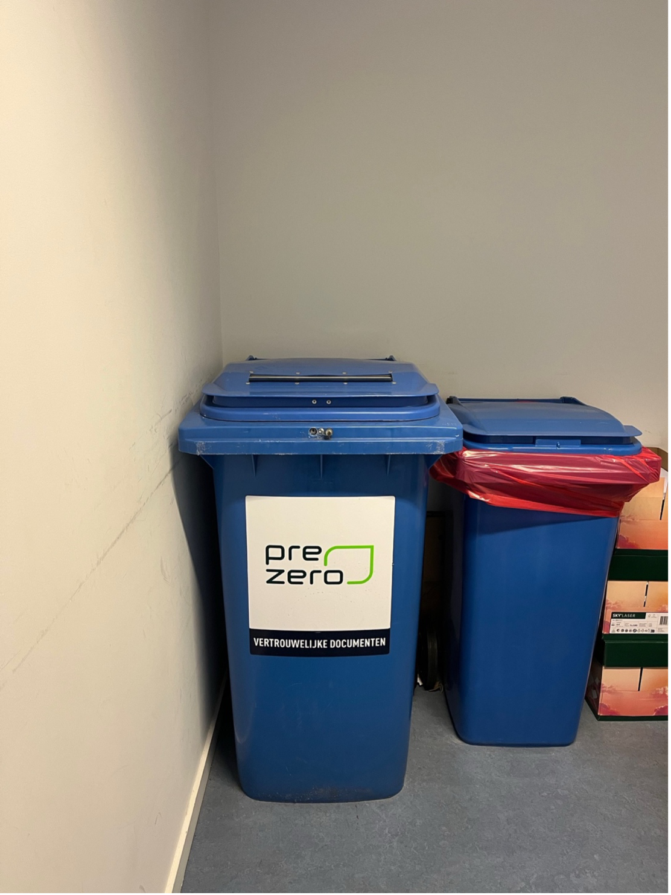

## Purpose

This document provides guidance on the appropriate procedures for digitizing informed consent forms which were originally collected on paper.

## Scope

This guidance applies to projects that have collected informed consent using physical forms and now wish to transfer the data into a digital format for long-term storage & to subsequently destroy the physical forms. 

Projects that fall under the **WMO regulation are not covered by this guidance**. For WMO-regulated projects, physical informed consent forms must be retained for the full data retention period of 15 years.

## Process

### **1. Preparation**

*	Gather all physical informed consent forms before starting digitization.
*	Check that all are present. 

### **2. Scanning Process**

*	Use VU printing services for scanning.
*	Log in with your VU ID card, username, and password.
*	Select ‘Scanning’ and ensure proper alignment of the document;
    +	All elements must be included (colour, signature, etc)
    + If the document is two sided, both should be scanned.
*	Send scanned file to your VU email.
*	Repeat until all physical consent forms are scanned.
*	**NB: DO NOT LEAVE FORMS UNATTENDED AT THE SCANNER**

### **3. Secure Storage**

*	Confirm receipt of all scanned forms in your email.
*	Store digitized consent forms in a secure location compliant with data protection policies.
*	Save files with a consistent naming convention 
    +	example: project_name_informed_concent_participant_ID_date_of_collection [healthy_schools_informed_consent_102d_30032025.pdf]

### **4. Verification of Digital Copies**

*	Conduct a quality check to ensure: 
    +	Each physical form has a corresponding digital version.
    +	Digital copies are clear, legible, and complete.

### **5. Disposal of physical consent forms**

*	Verify that all forms have been successfully digitized before disposing of physical copies.
    +	Use the 4 eyed approach; two people should review and verify that all informed consent has been successfully digitized. 
*	Delete scanned files from email and the recycling bin.
*	**Do not** discard physical informed consent forms in general recycling bins. These documents contain sensitive information and must be disposed of securely.
*	Physical forms should be disposed of in the [sensitive documentation bins located beside the printers](#sensitiveDocDisposal). The paper will then be shredded and disposed of in a secure manner. 

### **6. Inform RePS that documents have been digitized**

*	Send an email to research.data.fgb@vu.nl with the following information:
    +	Project title, number of documents digitized, date of digitization.

  

By following these steps, researchers can ensure the integrity, security, and compliance of digitized informed consent forms while properly handling physical copies.

  

